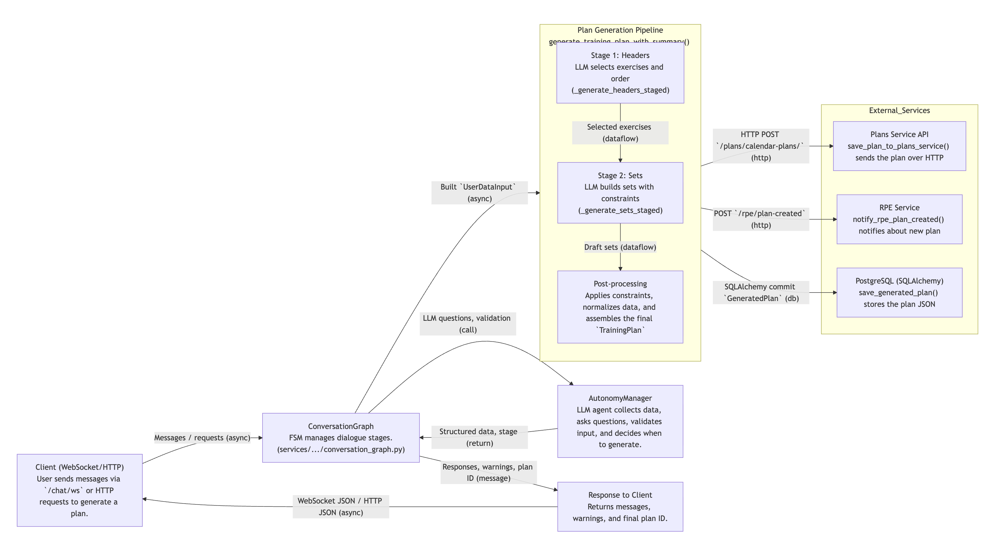

# WorkoutApp — Train Smarter. Progress Faster.

Modern strength training tracker that turns your plan into actionable daily workouts. Built with FastAPI + Flutter, designed for lifters and coaches who want data‑driven progress.

## Features

- User Management (Athletes, Trainers)
- Exercise Library and Tracking
- Progression Templates
- Workout Creation and Logging
- Strength Testing
- Performance Analytics

## Highlights

- Bold, fast mobile UI focused on set execution and clarity
- RPE engine with true 1RM derivation for accurate intensity prescriptions
- Readiness slider: scale weights (and optionally reps) with smart rounding
- Calendar plan wizard with meso/micro cycles and per-week day layout
- Clean architecture backend: routers → services → repositories

## Screenshots

<table>
  <tr>
    <td></td>
    <td></td>
  </tr>
  <tr>
    <td></td>
    <td></td>
  </tr>
</table>

## Architecture

- Backend: FastAPI microservices, SQLAlchemy ORM, Pydantic v2, Alembic (migrations)
- API Gateway (FastAPI) proxies all client traffic
- Frontend: Flutter (Material 3)
- Layers: `routers/` (HTTP), `services/` (business logic), `repositories/` (data)
- RPE/1RM logic: proper intensity tables and true 1RM calculation from real sets

## Authentication & User Scoping

All services use user-scoped data isolation via the **`X-User-Id` header**:

- **Header Name**: `X-User-Id` (case-insensitive matching in code)
- **Required**: All authenticated endpoints require this header; missing header returns `401 Unauthorized`
- **Propagation**: Services forward `X-User-Id` to downstream service calls (e.g., workouts-service → exercises-service, agent-service → plans-service)
- **Isolation**: Each service filters queries by `user_id` to ensure users only access their own data

### Services with User Scoping

- **exercises-service**: `exercise_instances` filtered by `user_id`
- **user-max-service**: `user_maxes` filtered by `user_id`
- **workouts-service**: `workouts`, `sessions`, etc. filtered by `user_id`
- **plans-service**: `calendar_plans` filtered by `user_id`
- **agent-service**: `generated_plans` filtered by `user_id`

### Gateway (Future)

The API Gateway will validate bearer tokens and inject the `X-User-Id` header for internal service calls. Services trust this header only from the gateway network.

## AI Agent Flow

- **Starter**: `services/agent-service/agent_service/main.py` boots FastAPI and creates a session in `ConversationGraph`.
- **Dialogue Brain**: `services/agent-service/agent_service/services/conversation_graph.py` runs the FSM, calls `AutonomyManager`, and decides which questions to ask.
- **Data Refinement**: `AutonomyManager` coordinates with prompts from `prompts/conversation.py`, normalizes answers, and checks readiness for generation.
- **Plan Generation**: `services/agent-service/agent_service/services/plan_generation.py` orchestrates staged LLM steps and assembles the `TrainingPlan`.
- **Integrations**: `services/agent-service/agent_service/services/plans_service.py` and `services/agent-service/agent_service/services/rpe_rpc.py` persist the result and notify the RPE service.